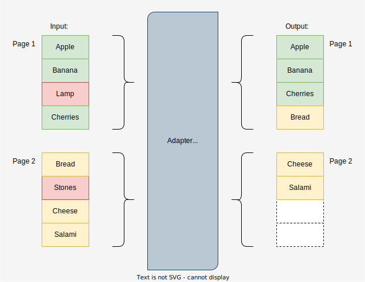
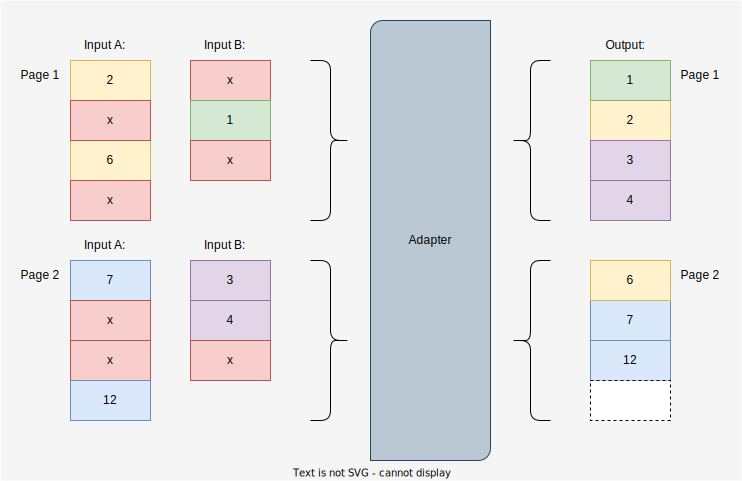
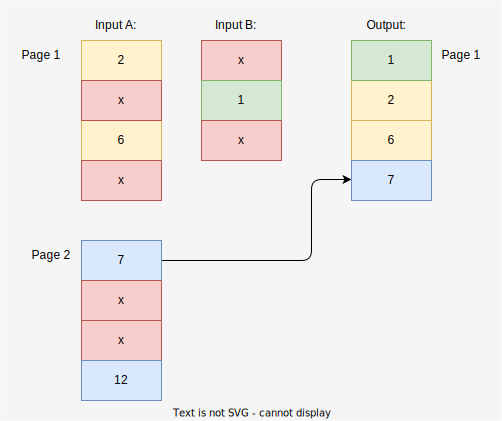

= Search Adapter
:figure-caption: Abbildung
:toc:
:toc-title:
:toclevels: 1

link:README_en.adoc[-> english version]

Ein Adapter für Such-APIs, die nicht tun was sie sollen.

== Im Dschungel der Such-APIs

*Folgende Anforderung liegt auf dem Tisch:*

Über ein Frontend sollen Entities in einer Liste seitenweise angezeigt werden können.
Die Darstellung soll sortierbar sein. Außerdem muss nach einigen Attributen gefiltert werden können.

Hierzu soll ein Adapter erstellt werden, welches die Daten von einem oder mehreren Backend-Systemen abruft
und dem Frontend bereitstellt.

Dabei soll natürlich darauf geachtet werden, dass
notwendige Zugriffe auf die genutzte(n) APIs so gering und klein wie nötig gehalten werden,
Sortierung und Paging über die gesamte Ergebnisliste hinweg konsistent sind und
der Algorithmus performant und ressourcenschonend arbeitet.

*Nach Sichtung der zur Verfügung stehenden APIs stellt sich Ernüchterung ein.*

Die APIs können bei weitem nicht das, was gebraucht wird:

Es fehlen wichtige Filtermöglichkeiten, das seitenweise Abrufen funktioniert nur über eine
Scroll-ID statt über eine Seitennummer, und für manche Abfragen müssen mehrere
Aufrufe gemacht und die Ergebnisse zusammengeführt werden.

Das sind eine Menge Probleme auf einmal. Aber sie sind allesamt lösbar!

Ich werde sie mit euch der Reihe nach durchgehen und jeweils eine Lösung erarbeiten und in Java implementieren.

[[custom-filters]]
== Nicht unterstützte Filter

Wenn Daten über die Möglichkeiten einer API hinaus gefiltert werden sollen,
ist eine 1:1-Zuordnung von abgerufenen Seiten und Seiten der Ergebnisliste
nicht mehr möglich. Es müssen u.U. weitere Daten nachgeladen werden, um eine
Ergebnisseite zu füllen.

[[custom-filters-image01]]
.Paging mit Filter

Um doppelte Abfragen auf die Quelldaten zu vermeiden, sollten diese mit einem Cache versehen werden.
(Im Beispiel <<custom-filters-image01>> muss für zwei verschiedene Ergebnisseiten auf Page 2 zugegriffen werden.)

Damit die Quelldaten nicht immer von Anfang an durchlaufen werden müssen, ist ein zusätzlicher zweiter Cache
für die Ergebnisseiten nötig. Wenn nur Indizes auf die Quelldaten im Cache liegen, kann dieser sehr groß gewählt
und damit die Zugriffszeit auf die richtige Quellseite erheblich reduziert werden.

[[custom-filters-image02]]
.Paging mit Filter - Nutzen eines Caches

[[scrollid-to-pagenumber]]
== Scroll-ID statt Seitennummer

Stellt die Backend-API das Laden einer Seite lediglich iterativ mithilfe einer Scroll-ID zur Verfügung,
so kann nicht frei auf eine bestimmte Seite zugegriffen werden. Es müssen also für das Laden einer Seite n alle vorherigen Seiten abgerufen werden.

[[scrollid-to-pagenumber-image03]]
.Mapping von ScrollId zu Seitennummer
image::images/ScrollIdToPaging.svg[]

Um den Zugriff zu beschleunigen, kann auch hier mit einem Cache gearbeitet werden.
Neben einem klassischen Cache für Seiten inklusive Daten bietet sich ein
Cache für die Zuordnung von Seitennummer zu Scroll-ID an.

Werden beim Caching die Suchparameter berücksichtigt, lässt sich das Laden von Daten
auch bei einer Änderung der Suche beschleunigen.

[[scrollid-to-pagenumber-image04]]
.Mapping von ScrollId zu Seitennummer - Nutzen von 2 Caches
image::images/ScrollIdToPagingWithCache.svg[]

Damit lässt sich die Lösung im Kapitel <<custom-filters>> auch auf APIs basierend auf
Scroll-IDs übertragen.

[[merge-responses]]
== Ergebnisse mehrerer Suchen

Mangels geeigneter Suchkriterien kann es nötig sein, Ergebnisse aus mehreren Suchanfragen zusammenzuführen.

Bei gleicher Seitengröße, jeweiliger Unterstützung der benötigten Sortierung und Filter und disjunkter Ergebnismenge
ist dies leicht zu bewerkstelligen. Die Ergebnisse der Einzelsuchen werden zu einer Liste mit doppelter Länge zusammensortiert.

[[merge-responses-image05]]
.Simples Mergen ohne nachträgliches Filtern
image::images/MergeResponsesSimple.svg[]

Dieser einfache Fall stellt leider einen Idealfall dar. In der Regel muss mit Einzelergebnissen mit variabler Länge gearbeitet werden.

[[merge-responses-image06]]
.Mergen bei variablen Seitenlängen

Mit den Mitteln aus den Kapiteln <<custom-filters>> und <<scrollid-to-pagenumber>> haben wir jedoch schon gute
Werkzeuge an der Hand, die - erweitert um etwas Logik - auch dieses Problem lösen.

Angenommen, wir haben in einer API zwei Suchmethoden, die beide benötigt werden, um eine Liste mit Ergebnissen
zu liefern. Beide Methoden unterstützen dieselbe Sortierung (hier aufsteigend numerisch), und beide bieten ein
Paging an. Bei Methode A hat eine Seite 4 Einträge, bei B sind es 3. Die Ergebnisliste soll seitenweise geliefert
werden können, mit einer Seitengröße von 4.

Um diese Liste zu füllen, müssen nach und nach Daten von A und B nachgeladen und einsortiert werden, bis eine Seite
vollständig ist. Die Herausforderung besteht darin, zu wissen, _wann_ sie vollständig ist.

In der Abbildung <<merge-responses-image06>> ist zu sehen, dass der Wert "3" erst mit Seite 2 von B geladen werden kann,
im Ergebnis jedoch mit zu Seite 1 gehört.

Gehen wir das einmal schrittweise durch:

=== Schritt 1

Von A wird die erste Seite gelesen und gefiltert. Die angeforderte Seite ist damit noch nicht gefüllt.

[[merge-responses-image07]]
.Ergebnisliste mit ersten Daten aus A füllen
image::images/MergeResponsesKomplexSolution1.svg[]

=== Schritt 2

Also wird die erste Seite mit Daten von B gelesen. Die gefilterten Daten werden zu den bisherigen
Ergebnissen sortiert. In der Ergebnisliste fehlt noch immer ein Eintrag.

[[merge-responses-image08]]
.Daten aus B hinzu sortieren
image::images/MergeResponsesKomplexSolution2.svg[]

=== Schritt 3

Es wird die nächste Seite von A (Page 2) geladen. Es gibt noch einen Wert (die "7"), die in die Ergebnisliste
übernommen werden kann, dann ist sie gefüllt. Es kann aber sein, dass in B noch Werte vorhanden sind,
die zwischen "2" und "6" einsortiert werden müssen.

[[merge-responses-image09]]
.Weitere Daten aus A hinzu sortieren

=== Schritt 4

Es wird die nächste Seite von B (Page 2) geladen. Hier gibt es tatsächlich noch die Werte "3" und "4", die
in die Ergebnisliste übernommen werden müssen. "6" und "7" werden in die nächste Seite verschoben
(diese kann für später gepuffert werden).

[[merge-responses-image10]]
.Weitere Daten aus B hinzu sortieren
image::images/MergeResponsesKomplexSolution4.svg[]

=== Schritt 5

Jetzt wird geprüft, ob es in A (die bereits geladene aber noch nicht vollständig übernommene Page 2) oder
in B (die nächste Page 3) noch Daten gibt, die kleiner als der letzte Eintrag ("4") der Ergebnisliste sind.
Das ist nicht der Fall, damit kann das Ergebnis (Page 1) abgeliefert werden.

[[merge-responses-image11]]
.Prüfen, ob weitere releante Daten vorhanden sind
image::images/MergeResponsesKomplexSolution5.svg[]

=== Daraus eribt sich dieser Algorithmus

Gegeben sind `n` Input-Methoden `M~1~ ... M~n~` mit jeweils einem `Index~n~` mit `(_Page#_, _Item#_)`,
der auf das nächste zu verwendene Element verweist.

1. für jede Methode `M~i~ | i = 1 ... n`, die noch Daten bereitstellen kann:
.. Lese die Daten und sortiere sie in der Ergebnisseite ein.
.. Wird ein Element aus `M~j~` in die nächste Ergebnisseite verschoben: aktualisiere `Index~j~`, sodass
   er auf dieses Element zeigt.
.. Aktualisiere `Index~i~`.
2. Prüfe, ob mindestens eine Methode `M~x~` potenziell weitere Daten zur Ergebnisseite beisteuern kann.
.. Das ist der Fall, wenn die Daten der aktuell geladenen Seite von `M~x~` vollständig verarbeitet wurden,
   d.h. `Index~x~` verweist auf das erste Element der folgenden Seite, und mind. 1 weitere Seite zur Verfügung steht.
3. Wenn ja, mache bei 1. weiter.

=== Caching

Für einen performanten Zugriff auf eine bestimmte Ergebnisseite können die Caching-Mechanismen der vorherigen Kapitel
angewandt werden.

Es sollte einen Cache für die Quelldaten und einen Cache mit Informationen zu den Ergebnisseiten geben.
Letzterer speichert zu jeder Ergebnisseite allerdings nun alle Indexe `Index~1...n~` der Quellmethoden `M~1...n~`.

[[merge-responses-image12]]
.Zusammenführen mehrerer Quellen mit Caches

Um eine bestimmte Seite abzurufen, reicht es, die Quelldaten ab den Indexen der letzten im Cache gespeicherten Seite
zu durchlaufen. Dabei kann der Cache um die fehlenden Seiteninfos aufgefüllt werden, sodass auch auf diese zukünftig
direkt zugegriffen werden kann.
