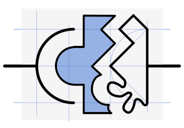
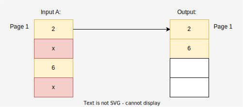

= Search Adapter
:figure-caption: Abbildung
:toc:
:toc-title:
:toclevels: 2

link:README_en.adoc[-> english version]

Ein Adapter für Such-APIs, die nicht tun was sie sollen.

== Im Dschungel der Such-APIs

*Folgende Anforderung liegt auf dem Tisch:*

Über ein Frontend sollen Entities in einer Liste seitenweise angezeigt werden können.
Die Darstellung soll sortierbar sein.
Außerdem muss nach einigen Attributen gefiltert werden können.

Hierzu soll ein Adapter erstellt werden, welches die Daten von einem oder mehreren Backend-Systemen abruft und dem Frontend bereitstellt.

Dabei soll natürlich darauf geachtet werden, dass notwendige Zugriffe auf die genutzte(n) APIs so gering und klein wie nötig gehalten werden, Sortierung und Paging über die gesamte Ergebnisliste hinweg konsistent sind und der Algorithmus performant und ressourcenschonend arbeitet.

*Nach Sichtung der zur Verfügung stehenden APIs stellt sich Ernüchterung ein.*

Die APIs können bei weitem nicht das, was gebraucht wird:

Es fehlen wichtige Filtermöglichkeiten, das seitenweise Abrufen funktioniert nur über eine Scroll-ID statt über eine Seitennummer, und für manche Abfragen müssen mehrere Aufrufe gemacht und die Ergebnisse zusammengeführt werden.

Das sind eine Menge Probleme auf einmal.
Aber sie sind allesamt lösbar!

Ich werde sie mit euch der Reihe nach durchgehen und jeweils eine Lösung erarbeiten und in Java implementieren.

[[custom-filters]]
== Nicht unterstützte Filter

Wenn Daten über die Möglichkeiten einer API hinaus gefiltert werden sollen, ist eine 1:1-Zuordnung von abgerufenen Seiten und Seiten der Ergebnisliste nicht mehr möglich.
Es müssen u.U. weitere Daten nachgeladen werden, um eine Ergebnisseite zu füllen.

[[custom-filters-image01]]
.Paging mit Filter
image::images/PagingWithFilter.svg[]

Um doppelte Abfragen auf die Quelldaten zu vermeiden, sollten diese mit einem Cache versehen werden.
(Im Beispiel <<custom-filters-image01>> muss für zwei verschiedene Ergebnisseiten auf Input-Page 2 zugegriffen werden.)

Damit die Quelldaten nicht immer von Anfang an durchlaufen werden müssen, ist ein zusätzlicher zweiter Cache für die Ergebnisseiten nötig.
Wenn nur Indizes auf die Quelldaten im Cache liegen, kann dieser sehr groß gewählt und damit die Zugriffszeit auf die richtige Quellseite erheblich reduziert werden.

[[custom-filters-image02]]
.Paging mit Filter - Nutzen eines Caches
image::images/PagingWithFilterAndCache.svg[]

=== Implementierung

Für unsere Anforderungen brauchen wir eine Methode, welche einen
Such-Request beantwortet, indem sie die gegebene API nutzt. Die Implementierung ist generisch gehalten,
um sie auf beliebige Entities und Such-APIs anwenden zu können:

[source, Java]
----
public PagedSearchResult<T> <1>
    findAndFilter(PagedSearchWithFilter<U, V> <2> <3>
            pagedSearchWithFilter) { ... }
----

<1> *T* = Typ der _Entity_
<2> *U* = Typ des nativen _Such-Requests_
<3> *V* = Typ des von der Such-API nicht unterstützten, _zusätzlichen Filters_

Diese Methode muss zunächst den korrekten *Index* auf die Input-Daten ermitteln,
also die richtige Seitennummer und das erste relevante Item innerhalb dieser
Seite. Das Ermitteln des Index lagern wir in eine weitere Methode aus, um später einen Cache
hinzufügen zu können.

[source, Java]
.ausgelagerte Methode zur Ermittlung des Index
----
private Index findIndex(PagedSearchWithFilter<U, V> search, OutputPageAndIndex start) {
    var index = start.index(); <1>
    long outputPage = start.page(); <1>
    long outputItemIndex = 0;
    long inputPage = 0;
    while (outputPage < search.page()) { <2>
        var items = cachedFind(new PagedSearch<>(search.search(), inputPage, search.pageSize())).items(); <3>
        if (items.isEmpty()) { <2>
            return Index.NONE;
        }
        var inputIndexes = IntStream.iterate(0, i -> i < items.size(), i -> i + 1).filter(i -> test(items.get(i), search.customFilter()))
                .boxed().toList(); <4>
        outputItemIndex += inputIndexes.size();
        if (outputItemIndex > search.pageSize()) {
            outputPage += outputItemIndex / search.pageSize();
            outputItemIndex = outputItemIndex % search.pageSize();
            index = new Index(inputPage, inputIndexes.get((int) (search.pageSize() - outputItemIndex - 1)));
        }
        inputPage++;
    }
    return index;
}
----

<1> *Index* enthält eine Seitennummer und die Position des ersten relevanten Items einer Input-Seite.
*OutputPage* zählt hoch bis zur angefragten Seite. *OutputItemIndex* zeigt auf die nächste freie Stelle innerhalb der
aktuellen Ausgabeseite. *InputPage* zählt hoch bis zur tatsächlich benötigten Input-Seite
<2> Es gibt zwei Abbruchbedinungen: die angeforderte Seite ist erreicht, oder es gibt keine Input-Daten mehr.
<3> Auch das Lesen der Input-Daten wird in eine eigene Methode ausgelagert, um sie cachen zu können.
<4> Der Index muss aktualisiert werden, sobald die gefilterten Daten nicht mehr in die gedachte
    Output-Seite passen. Dann muss er auf die aktuell gelesene Seite und das erste Item,
    das nicht mehr passt, zeigen.

[NOTE]
====
Da die Items selbst nicht benötigt werden, reicht es, sich eine gefilterte Liste ihrer Positionen zu merken,
und sich die richtige Position für den neuen Index herauszusuchen (z.B. `[0,1,*4*,5]`).
====

Jetzt wird die Ergebnisseite so lange mit Daten aufgefüllt, bis sie die richtige Länge
erreicht oder keine weiteren Daten mehr zur Verfügung stehen:

[source, Java]
.Die vollständige Suchmethode
----
public PagedSearchResult<T> findAndFilter(PagedSearchWithFilter<U, V> pagedSearchWithFilter)

    var index = findIndex(pagedSearchWithFilter, FIRST);
    if (index == Index.NONE) { <1>
        return new PagedSearchResult<>(List.of(), pagedSearchWithFilter.page(), pagedSearchWithFilter.pageSize());
    }

    var itemsResult = new ArrayList<T>();
    while (itemsResult.size() < pagedSearchWithFilter.pageSize()) { <2>
        var searchResult = cachedFind(new PagedSearch<>(pagedSearchWithFilter.search(), index.page(), pagedSearchWithFilter.pageSize()));
        if (searchResult.items().isEmpty()) { <2>
            return new PagedSearchResult<>(itemsResult, pagedSearchWithFilter.page(), pagedSearchWithFilter.pageSize());
        }
        itemsResult.addAll(searchResult.items().stream()
            .skip(index.item())  <3>
            .filter(item -> test(item, pagedSearchWithFilter.customFilter()))
            .toList());
        index = new Index(index.page() + 1, 0); <4>
    }
    return new PagedSearchResult<>(itemsResult.stream()
        .limit(pagedSearchWithFilter.pageSize()) <5>
        .toList(), pagedSearchWithFilter.page(), pagedSearchWithFilter.pageSize());
}
----
<1> Konnte kein Index ermittelt werden, ist das Ergebnis eine leere Seite.
<2> Die Methode hat zwei Abbruchbedingungen: die *Output-Seite ist gefüllt* oder es gibt *keine Daten mehr*,
<3> Es werden die ersten, nicht benötigten Items ignoriert, dann gefiltert und dann der Seite hinzugefügt.
<4> Mache bei der nächsten Seite und dem ersten Item darin weiter.
<5> Als Ergebnis wird die Seite, beschnitten auf die geforderte Seitenlänge, zurückgegeben.

=== Caches

Für die Caches nutze ich `Caffeine` (siehe link:https://github.com/ben-manes/caffeine[]):

Der *Input-Cache* ist einfach umgesetzt:

[source, Java]
.Implementierung des Input-Caches
----
private Cache<PagedSearch<U>, PagedSearchResult<T>> inputCache; <1>

inputCache = Caffeine.newBuilder()
        .expireAfterWrite(5, MINUTES) <2>
        .maximumSize(inputCacheSize) <3>
        .build();

private PagedSearchResult<T> cachedFind(PagedSearch<U> pagedSearch) {
    return inputCache.get(pagedSearch, this::find);
}

abstract PagedSearchResult<T> find(PagedSearch<U> pagedSearch); <4>
----
<1> Der Cache für *Input-Seiten*, abhängig von der aktuellen Suche.
<2> In dieser Konfiguration werden die Daten nach 5 Minuten neu geladen. Dieser Wert muss entsprechend den
    Anforderungen der Anwendung gewählt werden.
<3> Die Anzahl *Input-Seiten*, die der Cache fasst.
<4> Diese Methode muss für eine Suche mit der konkreten Input-API implementiert werden.

Der *Index-Cache* funktioniert ähnlich, wir müssen allerdings ein paar Dinge beachten.

[source, Java]
.Implementierung des Index-Cache
----
indexCache = Caffeine.newBuilder()
    .expireAfterWrite(5, MINUTES)
    .maximumSize(indexCacheSize) <1>
    .build();

private Index cachedFindIndex(PagedSearchWithFilter<U, V> search) {
    var result = indexCache.getIfPresent(search); <2>
    if (result != null) {
        return result;
    }
    return findIndex(search, findLastCachedIndex(search)); <3>
}
----
<1> Die Kapazität des Index-Cache kann und sollte deutlich größer als die des Input-Caches gewählt werden.
<2> Damit neben dem gesuchten Index weitere Indexe im Cache gespeichert werden können,
darf nicht die Lamda-Funktion des Caches genutzt werden.  Änderungen des Caches
innerhalb dieser Lambda-Funktion sind nicht erlaubt.
<3> Es wurde kein Eintrag zur gesuchten Seite gefunden. Ermittle den Index ausgehen vom letzten im Cache gespeicherten
Index (siehe unten).

*Da die Indexe iterativ gefunden werden, macht es Sinn, alle unterwegs gefundenen Indexe im Cache abzulegen, nicht nur den gesuchten.*

[source, Java]
.gefundene Indexe im Cache speichern
----
private Index findIndex(PagedSearchWithFilter<U, V> search, OutputPageAndIndex start) {
    ...
    if (outputItemIndex > search.pageSize()) {
        ...
        index = new Index(...);
        indexCache.put(new PagedSearchWithFilter<>(search.search(), search.customFilter(), outputPage, search.pageSize()), index); <1>
    }
    ...
}
----

<1> Jeden gefundenen Index im Cache speichern.

*Die Suche nach einem Index zu einer angefragten Output-Seite sollte beim letzten bekannten Index beginnen.*

.Starte Index-Suche beim letzten gecachten Index

Im Beispiel wird die Seite 105 angefragt. Der letzte gespeicherte Index existiert zu Seite 101. Also
muss ab Seite 101 iteriert werden, um den Index für Seite 105 zu errechnen.

Gerade diese zweite Anforderung kann ein Cache normalerweise nicht leisten, da Caches als Map organisiert sind.
Der Key liegt nicht als sortierte Liste vor, es gibt deswegen keinen guten Suchalgorithmus für einen maximalen Wert,
kleiner als ein bestimmter Wert. Ein Sortieren des KeySet des Cache ist u.U. aufwändiger, als den Cache einfach
- beginnend von der gesuchten Seite an - abwärts nach einem bereits bekannten Index zu durchsuchen.

Methode, um den letzten im Cache gespeicherten Index zu einer Output-Seite zu finden.

[source, Java]
.Suche nach dem letzten bekannten Index
----
OutputPageAndIndex findLastCachedIndex(PagedSearchWithFilter<U, V> search) {
    if (search.page() == 0) {
        return ROOT;
    }
    var i = search.page();
    PagedSearchWithFilter<U, V> key;
    do {
        i--;
        key = new PagedSearchWithFilter<>(search.search(), search.customFilter(), i, search.pageSize());
    } while (i > 0 && !indexCache.asMap().containsKey(key));
    if (i == 0) {
        return ROOT;
    }
    return new OutputPageAndIndex(i, indexCache.getIfPresent(key));
}
----

Den gesamten Quellcode für den `SearchWithFilterAdapter` gibt es
link:src/main/java/de/dreierschach/searchadapter/customFilter/SearchWithFilterAdapter.java[hier],
eine Test-Implementierung des Adapters findet sich
link:src/test/java/de/dreierschach/searchadapter/customFilter/[in diesem Ordner].

[[scrollid-to-pagenumber]]
== Scroll-ID statt Seitennummer

Stellt die Backend-API das Laden einer Seite lediglich iterativ mithilfe einer Scroll-ID zur Verfügung, so kann nicht frei auf eine bestimmte Seite zugegriffen werden.
Es müssen also für das Laden einer Seite alle vorherigen Seiten abgerufen werden.

[[scrollid-to-pagenumber-image03]]
.Mapping von ScrollId zu Seitennummer

Um den Zugriff zu beschleunigen, kann auch hier mit einem Cache gearbeitet werden.
Neben einem klassischen Cache für Seiten inklusive Daten bietet sich ein Cache für die Zuordnung von Seitennummer zu Scroll-ID an.

Werden beim Caching die Suchparameter berücksichtigt, lässt sich das Laden von Daten auch bei einer Änderung der Suche beschleunigen.

[[scrollid-to-pagenumber-image04]]
.Mapping von ScrollId zu Seitennummer - Nutzen von 2 Caches

Mit dieser Vorgehensweise lässt sich die Lösung in Kapitel <<custom-filters>> auch auf APIs basierend auf Scroll-IDs übertragen.

Eine Implementierung ist vergleichsweise simpel, da zwischen Input- und Output-Seiten
eine 1:1-Beziehung besteht.

Es muss lediglich ein Cache (Output-Seite -> Scroll-Id) statt (Output-Seite -> Input-Seite) verwendet werden.
Dieser arbeitet ähnlich wie der Index-Cache aus <<custom-filters>>.

Auch hier sollten alle beim Iterieren gefundenen Scroll-Ids im Cache gespeichert werden, und bei der Suche nach einer
Scroll-ID sollte bei der letzten bekannten Scroll-ID begonnen werden.

Den Quellcode für den `SearchWithScrollIdAdapter` gibt es
link:src/main/java/de/dreierschach/searchadapter/scollId/SearchWithScrollIdAdapter.java[hier],
eine Test-Implementierung des Adapters findet sich
link:src/test/java/de/dreierschach/searchadapter/scrollId/[in diesem Ordner].

[[merge-responses]]
== Ergebnisse mehrerer Suchen zusammenführen

Mangels geeigneter Suchkriterien kann es nötig sein, Ergebnisse aus mehreren Suchanfragen zusammenzuführen.

=== Idealfall immer gleicher Seitenlängen

Bei gleicher Seitengröße, jeweiliger Unterstützung der benötigten Sortierung und Filter und disjunkter Ergebnismenge ist dies leicht zu bewerkstelligen.
Die Ergebnisse der Einzelsuchen werden zu einer Liste mit doppelter Länge zusammensortiert.

[[merge-responses-image05]]
.Simples Mergen ohne nachträgliches Filtern

=== Die Realität

Dieser einfache Fall stellt leider einen Idealfall dar.
In der Regel muss mit Einzelergebnissen mit variabler Länge gearbeitet werden.

[[merge-responses-image06]]
.Mergen bei variablen Seitenlängen
image::images/MergeResponsesKomplex.svg[]

Mit den Mitteln aus den Kapiteln <<custom-filters>> und <<scrollid-to-pagenumber>> haben wir jedoch schon gute Werkzeuge an der Hand, um - erweitert um etwas Logik - auch dieses Problem zu lösen.

Angenommen, wir haben in einer API zwei Suchmethoden, die beide benötigt werden, um eine Liste mit Ergebnissen zu liefern.
Beide Methoden unterstützen dieselbe Sortierung (hier aufsteigend numerisch), und beide bieten ein Paging an.
Bei Methode A hat eine Seite 4 Einträge, bei B sind es 3. Die Ergebnisliste soll seitenweise geliefert werden können, mit einer Seitengröße von 4.

Um diese Liste zu füllen, müssen nach und nach Daten von A und B nachgeladen und einsortiert werden, bis eine Seite vollständig ist.
Die Herausforderung besteht darin, zu wissen, _wann_ sie vollständig ist.

In Abbildung <<merge-responses-image06>> ist zu sehen, dass der Wert "3" erst mit Seite 2 von B geladen werden kann, im Ergebnis jedoch mit zu Seite 1 gehört.

Gehen wir das einmal schrittweise durch:

==== Schritt 1

Von A wird die erste Seite gelesen und gefiltert.
Die angeforderte Seite ist damit zur Hälfte gefüllt.

[[merge-responses-image07]]
.Ergebnisliste mit ersten Daten aus A füllen

==== Schritt 2

Also wird die erste Seite mit Daten von B gelesen.
Die gefilterten Daten werden zu den bisherigen Ergebnissen sortiert.
In der Ergebnisseite fehlt noch immer ein Eintrag.

[[merge-responses-image08]]
.Daten aus B hinzu sortieren
image::images/MergeResponsesKomplexSolution2.svg[]

==== Schritt 3

Es wird die nächste Seite von A (Page 2) geladen.
Es gibt noch einen Wert ("7"), der in die Ergebnisliste übernommen werden kann, dann ist sie gefüllt.
Es kann jedoch sein, dass in B noch Werte vorhanden sind, die zwischen "2" und "6" einsortiert werden müssen.

[[merge-responses-image09]]
.Weitere Daten aus A hinzu sortieren
image::images/MergeResponsesKomplexSolution3.svg[]

==== Schritt 4

Es wird die nächste Seite von B (Page 2) geladen.
Hier gibt es tatsächlich noch die Werte "3" und "4", die in die Ergebnisliste übernommen werden müssen. "6" und "7" werden in die nächste Seite verschoben.

[[merge-responses-image10]]
.Weitere Daten aus B hinzu sortieren
image::images/MergeResponsesKomplexSolution4.svg[]

==== Schritt 5

Jetzt wird geprüft, ob es in A (die bereits geladene aber noch nicht vollständig übernommene Page 2) oder in B (die nächste Page 3) noch Daten gibt, die kleiner als der letzte Eintrag ("4") der Ergebnisliste sind.
Das ist nicht der Fall, damit kann das Ergebnis (Page 1) abgeliefert werden.

[[merge-responses-image11]]
.Prüfen, ob weitere releante Daten vorhanden sind

=== Lösungsalgorithmus

Gegeben sind `n` Input-Methoden `M~1~ ... M~n~` mit jeweils einem `Index~n~` mit `(_Page#_, _Item#_)`, der auf das nächste zu verwendene Element verweist.

1. für jede Methode `M~i~ | i = 1 ... n`, die noch Daten bereitstellen kann:
.. Lese die Daten und sortiere sie in der Ergebnisseite ein.
.. Wird ein Element aus `M~j~` in die nächste Ergebnisseite verschoben: aktualisiere `Index~j~`, sodass er auf dieses Element zeigt.
.. Aktualisiere `Index~i~`.
2. Prüfe, ob mindestens eine Methode `M~x~` potenziell weitere Daten zur Ergebnisseite beisteuern kann.
.. Das ist der Fall, wenn die Daten der aktuell geladenen Seite von `M~x~` vollständig verarbeitet wurden, d.h. `Index~x~` verweist auf das erste Element der folgenden Seite, und mind. 1 weitere Seite zur Verfügung steht.
3. Wenn ja, mache bei 1. weiter.

Das Problem <<custom-filters>> stellt einen Spezialfall dieses Algorithmus' dar.
Speichert der Cache Scroll-IDs statt Seitenzahlen der jeweiligen Input-Methode ab, so deckt er auch das Problem <<scrollid-to-pagenumber>> ab.

=== Suchanfragen minimieren

Für einen performanten Zugriff auf eine bestimmte Ergebnisseite können die Caching-Mechanismen der vorherigen Kapitel angewandt werden.

Es sollte einen Cache für die Quelldaten und einen Cache mit Informationen zu den Ergebnisseiten geben.
Letzterer speichert zu jeder Ergebnisseite allerdings nun alle Indexe `Index~1...n~` der Quellmethoden `M~1...n~`.

[[merge-responses-image12]]
.Zusammenführen mehrerer Quellen mit Caches
image::images/MergeResponsesKomplexSolutionWithCache.svg[]

Um eine bestimmte Seite abzurufen, reicht es, die Quelldaten ab den Indexen der letzten im Cache gespeicherten Seite zu durchlaufen.
Dabei kann der Cache um die fehlenden Seiteninfos aufgefüllt werden, sodass auch auf diese zukünftig direkt zugegriffen werden kann.
