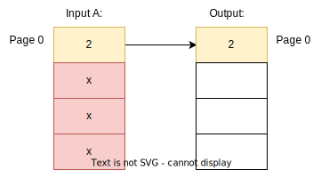
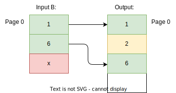
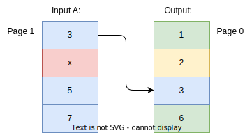
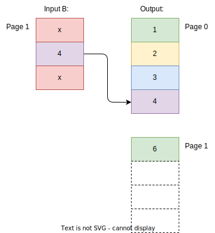
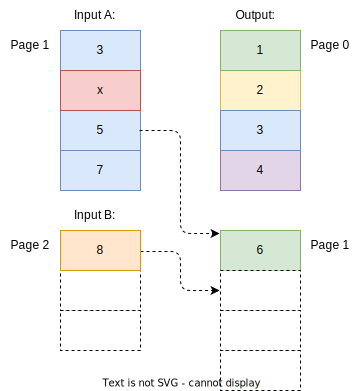

[[merge-responses]]
== Ergebnisser mehrerer Suchen

Mangels geeigneter Suchkriterien kann es nötig sein, Ergebnisse aus mehreren Suchanfragen zusammenzuführen.

Bei gleicher Seitengröße, jeweiliger Unterstützung der benötigten Sortierung und Filter und disjunkter Ergebnismenge
ist dies leicht zu bewerkstelligen. Die Ergebnisse der Einzelsuchen werden zu einer Liste mit doppelter Länge zusammensortiert.

image:../images/MergeResponsesSimple.svg[]

Dieser einfache Fall stellt leider einen Idealfall dar. In der Regel müssen wir mit Teilergebnissen mit variabler Länge arbeiten.

image:../images/MergeResponsesKomplex.svg[]

Mit den Mitteln aus <<custom-filters>> und <<scrollid-to-pagenumber>> haben wir jedoch schon gute Werkzeuge an der Hand,
die - erweitert um etwas Logik - auch dieses Problem lösen.

*Schritt 1*

*Schritt 2*

*Schritt 3*

*Schritt 4*

*Schritt 5*

