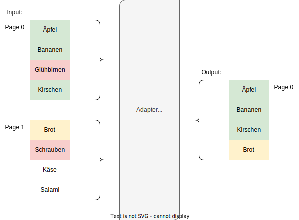
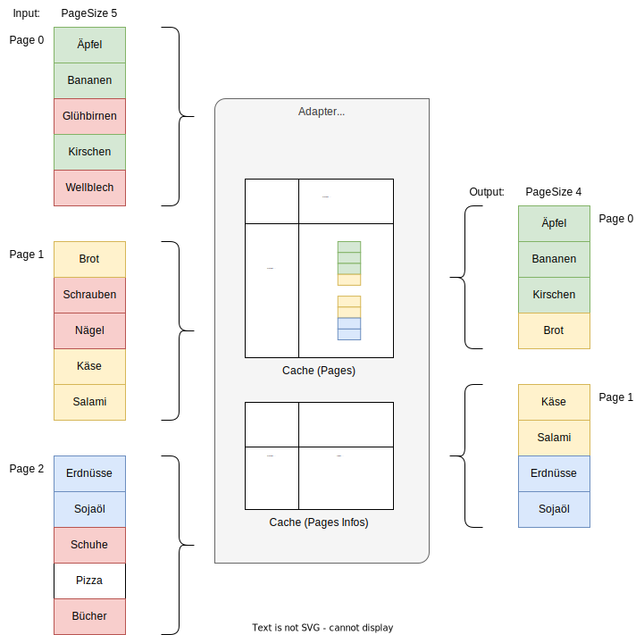

= Search Adapter
:toc:
:toc-title: Inhalt

== Problemstellung

Über ein Frontend sollen Entities in einer Liste seitenweise angezeigt werden können.
Die Darstellung soll sortierbar sein. Außerdem muss nach einigen Attributen gefiltert werden können.

Oft steht man vor einem oder mehreren der folgenden Probleme:

1. die zur Verfügung stehende API unterstützt nicht alle benötigten Filtermöglichkeiten
2. es wird keine Seitennummer, sondern stattdessen eine Scroll-Id zur Fortführung der Suche unterstützt
3. es müssen mehrere Suchmethoden aufgerufen werden, die Ergebnisse müssen gemergt werden

Diese Probleme sind grundsätzlich lösbar. Dabei sollen aber diese Kriterien eingehalten werden:

- Die notwendigen Zugriffe auf die genutzte(n) APIs sollen so gering und klein wie nötig gehalten sein.
- Im Ergebnis müssen die Sortierung und das Paging über die gesamte Ergebnisliste hinweg konsistent sein.
- Es muss sowohl auf Performance als auch auf Speicherauslastung geachtet werden.

== Fall 1: Nicht unterstützte Filter

Wenn Daten zusätzlich gefiltert werden sollen, ist eine 1:1-Zuordnung von abgerufenen Daten und Ergebnisliste
nicht mehr möglich. Es müssen u.U. weitere Daten nachgeladen weren, um eine Ergebnisseite zu füllen.

Damit zum Laden einer bestimmten Seite nicht alle vorherigen Seiten aus dem Backend
nachgeladen werden müssen, sollten die vom Adapter erzeugten Seiten gecached werden.

* Die Vorhaltedauer und Größe des Caches muss abhängig von der konkreten Anwendung gewählt werden.
* Sollte eine Seite nicht mehr im Cache liegen, müssen ausgehend von der letzten
  vorherigen Seite im Cache alle Inhalte erneut geladen werden. Deswegen darf der Cache nicht zu klein gewählt werden.
* Alternativ könnte es einen zweiten parallelen Cache geben, der Seite und Index der Ausgangsdaten
  jeder bereits geladenen Seite enthält. Dieser kann dann deutlich mehr Seiten im Speicher halten und
  das Nachladen dadurch deutlich beschleunigen.

