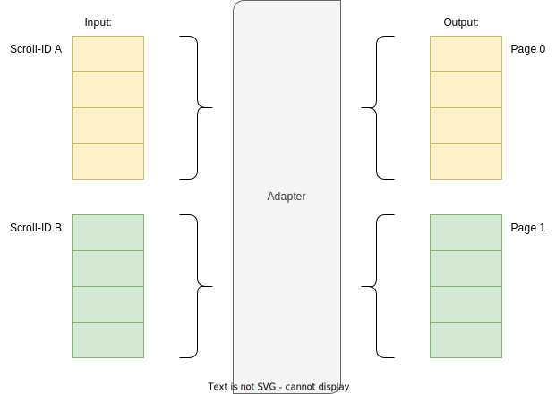
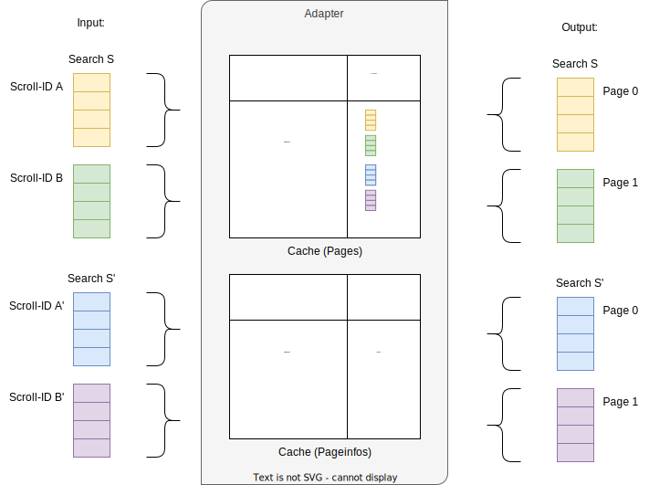

= Search Adapter
:toc:
:toc-title: Inhalt

== Im Dschungel der Such-APIs

*Folgende Anforderung liegt auf dem Tisch:*

Über ein Frontend sollen Entities in einer Liste seitenweise angezeigt werden können.
Die Darstellung soll sortierbar sein. Außerdem muss nach einigen Attributen gefiltert werden können.

Hierzu soll ein Adapter erstellt werden, das die Daten von einem oder mehreren Backend-Systemen abruft
und dem Frontend bereitstellt.

Dabei soll natürlich darauf geachtet werden, dass
notwendige Zugriffe auf die genutzte(n) APIs so gering und klein wie nötig gehalten werden,
Sortierung und Paging über die gesamte Ergebnisliste hinweg konsistent sind und
der Algorithmus performant und ressourcenschonend arbeitet

*Nach Sichtung der zur Verfügung stehenden APIs stellt sich Ernüchterung ein.*

Die APIs können bei weitem nicht das, was gebraucht wird:

Es fehlen wichtige Filtermöglichkeiten, das seitenweise Abrufen funktioniert über eine
Scroll-ID statt über eine Seitennummer, und / oder für manche Abfragen müssen mehrere
Aufrufe gemacht und die Ergebnisse zusammengeführt werden.

== Nicht unterstützte Filter

Wenn Daten über die Möglichkeiten einer API hinaus gefiltert werden sollen,
ist eine 1:1-Zuordnung von abgerufenen Seiten und Seiten der Ergebnisliste
nicht mehr möglich. Es müssen u.U. weitere Daten nachgeladen weren, um eine
Ergebnisseite zu füllen.

image::images/PagingWithFilter.svg[]

Damit zum Laden einer bestimmten Seite nicht alle vorherigen Seiten aus dem Backend
nachgeladen werden müssen, sollten die vom Adapter erzeugten Seiten gecached werden.

* Die Vorhaltedauer und Größe des Caches muss abhängig von der konkreten Anwendung gewählt werden.
* Sollte eine Seite nicht mehr im Cache liegen, müssen ausgehend von der letzten
  vorherigen Seite im Cache alle Inhalte erneut geladen werden. Deswegen darf der Cache nicht zu klein gewählt werden.
* Mit einem zweiten, parallel gepflegten Cache, welcher Seite und Index der Ausgangsdaten
  einer Seite enthält, können deutlich mehr Seiten im Speicher gehalten
  und damit das Nachladen von Daten wesentlich reduziert werden.

image::images/PagingWithFilterAndCache.svg[]

== Scroll-ID statt Seitennummer

Stellt die Backend-API das Laden einer Seite lediglich iterativ mithilfe einer Scroll-ID zur Verfügung,
so kann nicht frei auf eine bestimmte Seite zugegriffen werden. Es müssen also für das Laden einer Seite n alle vorherigen Seiten abgerufen werden.

Um den Zugriff zu beschleunigen, kann auch hier mit einem Cache gearbeitet werden.
Neben einem klassischen Cache für Seiten inklusive Daten bietet sich ein
Cache für die Zuordnung von Seitennummer zu Scroll-ID an.

Werden beim Caching die Suchparameter berücksichtigt, lässt sich das Laden von Daten
auch bei einer Änderung der Suche beschleunigen.

